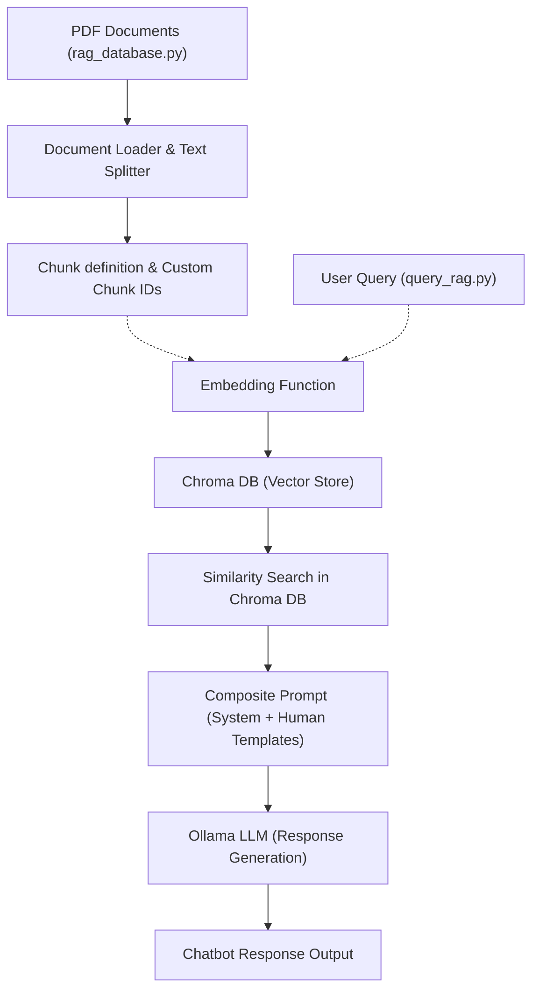

# AI Chatbot with Local RAG using LangChain, Ollama, and Chroma DB

**Objective**: This repository demonstrates the implementation of an AI Chatbot entirely on your local that can be used to generate content by retrieving data from your personal files!

**Tech Stack**
- Python
- LangChain Framework
- Ollama API for **Vector Embedding** *(model = "nomic-embed-text")* and **Text Generation** *(models = "mistral", "gemma3:1b")*
- Chroma DB for vector storage

## Overview

This project implements a robust AI chatbot solution that leverages a local Retrieval-Augmented Generation (RAG) architecture. By combining the strengths of [LangChain](https://python.langchain.com/), [Ollama](https://ollama.com/), and [Chroma DB](https://www.trychroma.com/), the system answers user inquiries by dynamically retrieving and synthesizing information from ingested documents. The solution is specifically tailored to address 6th-grade math curriculum queries, ensuring responses are pedagogically sound, step-by-step, and easy for students to understand (feel free to change the data and use it for your own purpose!).

## Project Scope

- **Local RAG Architecture:** Integrates document retrieval with AI text generation to deliver contextually relevant, high-quality answers.
  
- **Document Ingestion and Indexing:** Uses PDF loaders and text splitters to convert documents into searchable chunks, then stores these embeddings in a Chroma vector database.
  
- **Customizable Prompt Engineering:** Employs system and human prompt templates to enforce a consistent, educator-friendly tone throughout the responses.
  
- **Seamless LLM Integration:** Utilizes Ollama LLMs (e.g., `mistral` or `gemma3:1b`) to process composite prompts and generate detailed, step-by-step answers.

## Workflow

1. **Document Ingestion:**
   - **Source:** The script `rag_database.py` loads PDFs from the `data` directory using the `PyPDFDirectoryLoader`.
   - **Processing:** Documents are segmented into smaller chunks by `RecursiveCharacterTextSplitter`, which maintains context continuity by allowing slight overlaps.
   - **Custom Chunk Identification:** The `define_chunk_ids()` function tags each chunk with a custom ID based on its source and page information.

2. **Database Creation and Management:**
   - **Embedding:** The embedding function defined in `get_embedding_function.py` instantiates `OllamaEmbeddings` using the `nomic-embed-text` model.
   - **Storage:** Chroma DB is used to persistently store the document chunks with their respective embeddings.
   - **Database Update:** Before adding new documents, the system verifies whether a chunk already exists in the database using its custom ID, ensuring data integrity.

3. **Query Processing and Response Generation:**
   - **Query Retrieval:** The `query_rag.py` script accepts a user query via the command line and retrieves the most relevant chunks from Chroma DB.
   - **Prompt Engineering:** Custom system instructions—implemented using `SystemMessagePromptTemplate`—ensure that the LLM behaves as a middle school math teacher with an encouraging tone. A composite prompt is assembled with both system instructions and the retrieved context.
   - **Response Generation:** The composite prompt is passed to the LLM (through `OllamaLLM`), which generates a detailed, step-by-step answer. Multiple example problems of varied difficulty are provided, alongside a concluding challenge question with a hint.

## Files Description

- **`get_embedding_function.py`:**
  - Contains the function to instantiate the embedding function using `OllamaEmbeddings` configured with the `nomic-embed-text` model.

- **`rag_database.py`:**  
  - **Document Loading:** Uses a PDF loader to ingest documents.
  - **Text Splitting:** Applies a recursive character text splitter to create context-preserving chunks.
  - **Custom ID Assignment:** Implements a function to create unique IDs for each chunk.
  - **Chroma DB Integration:** Adds processed chunks to the local Chroma vector database and provides an option to reset (clear) the database.

- **`query_rag.py`:**  
  - **Prompt Composition:** Combines system instructions with retrieved document chunks using LangChain’s chat prompt templates.
  - **Query Execution:** Retrieves relevant content from Chroma DB, formats the query prompt, and invokes an LLM to generate the final response.
  
## Prerequisites & Installation

1. **Python Environment:**  
   Ensure you are running Python 3.11 or later.

2. **Install Dependencies:**  
   Install the necessary packages using the `requirements.txt` file
   ```bash
   pip3 install -r requirements.txt
   ```

3. **Set Up Chroma DB:**
   Start a local Chroma DB server (if needed) using:
  ```bash
  chroma run --host localhost --port 8000 --path ./chromadb
  ```

4. Data Requirements:
   Place your PDF documents in the data folder for ingestion.

## How to Run
- Download and install Ollama:
  1. Download Ollama from [the official website](https://ollama.com/) or I prefer using homebrew with MacOS
     ```bash
       brew install ollama
     ```

  2. Ensure it is working properly by typing `ollama` in the CLI. Once it's working start the API connection by using the following code:
     ```bash
       ollama serve
     ```

  3. Now, pull the models required for the application one-by-one, and the API will be ready for use.
     ```bash
       ollama pull nomic-embed-text
       ollama pull mistral
       ollama pull gemma3:1b
     ```
  
- Index Documents:
  - To ingest and index the documents, execute:
    ```bash
        python3 rag_database.py
  - Use the `--reset` flag to clear the existing database before indexing:
    ```bash
        python3 rag_database.py --reset
- Query the Chatbot:

To generate an answer based on a user query, run:
   ```bash
   python3 query_rag.py "What is the area of a triangle with base 6cm and height 8cm?"
   ```
## Workflow



## Outcome
**Responsive Educational Chatbot:** The implemented chatbot delivers well-structured, pedagogically sound responses to 6th-grade math inquiries.

**Efficient Information Retrieval:** The system effectively leverages a local Chroma vector database to retrieve context-relevant document chunks.

**Integrated AI Pipeline:** By combining LangChain for prompt management, Ollama for LLM capabilities, and Chroma DB for vector storage, the solution represents a modern, scalable AI application engineered for educational outreach.

## License
This project is licensed under the MIT License. See the LICENSE file for details.

## Acknowledgments
[LangChain](https://python.langchain.com/)

[Ollama](https://ollama.com/)

[Chroma DB](https://www.trychroma.com/)

## Sources
Documents: [NCERT](https://ncert.nic.in/textbook.php?lemh1=6-6_)

Inspiration: [Pixegami](https://github.com/pixegami/langchain-rag-tutorial)
